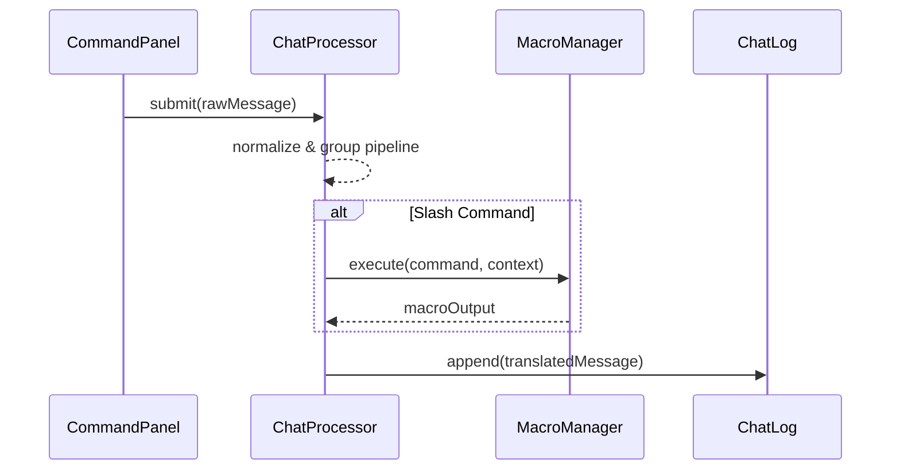

# Chat Specification

## Data Structures
```ts
export interface ChatMessage {
  id: string;
  author: string;
  body: string;
  channel: "public" | "gm" | "whisper";
  createdAt: number;
  metadata?: Record<string, unknown>;
}
```
- Channels match translation rule groups for filtering/rewriting output.【F:src/main/java/net/rptools/maptool/client/ui/chat/ChatProcessor.java†L20-L42】

## Translation Pipeline
```ts
type Translator = (msg: ChatMessage) => ChatMessage;
export interface TranslationGroup {
  id: string;
  enabled: boolean;
  translators: Translator[];
}
```
- Groups correspond to `ChatTranslationRuleGroup` installations processed sequentially.【F:src/main/java/net/rptools/maptool/client/ui/chat/ChatProcessor.java†L20-L41】


- Lifecycle mirrors the sequence executed in `examples/chat-macro.tsx`, clarifying when macro runtime receives command payloads and when chat history updates.

## API
- `registerTranslator(group: TranslationGroup)` adds to pipeline; disabled groups skipped.
- `processIncoming(msg)` returns transformed message and logs original for debugging.
- Macro output integrates via MacroManager to push new messages with metadata tags.【F:src/main/java/net/rptools/maptool/client/macro/MacroManager.java†L85-L120】

## Events
- `chat:message` fired after translation; UI listens for real-time updates.
- `chat:translator-toggled` notifies settings panel to persist preferences.
- `chat:pipeline:debug` (optional) captures each stage output for inspector tools in development builds.
