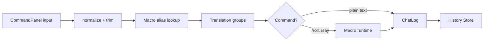

# Chat & Dice

CommandPanel registers for chat events, maintains history stack, impersonation identities, and installs smiley translation group; map to rich text composer with macro injection.【F:src/main/java/net/rptools/maptool/client/ui/commandpanel/CommandPanel.java†L31-L189】

```tsx
function ChatDock(){return(<div className="flex flex-col">...</div>);}
```

ChatProcessor hosts translation rule groups and dice/macro parsing; expose pluggable pipeline for slash commands before dispatch.【F:src/main/java/net/rptools/maptool/client/ui/commandpanel/CommandPanel.java†L101-L179】【F:src/main/java/net/rptools/maptool/client/macro/MacroManager.java†L85-L120】

Typing notifications tie into ChatNotificationTimers posting UI updates; surface as bus events feeding status rail badges.【F:src/main/java/net/rptools/maptool/client/ui/MapToolFrame.java†L309-L347】

### Command Parsing Lifecycle

- Mirrors `CommandPanel` → `ChatProcessor` → `MacroManager` orchestration; ensures macro output loops back into log stream.【F:src/main/java/net/rptools/maptool/client/ui/commandpanel/CommandPanel.java†L101-L179】【F:src/main/java/net/rptools/maptool/client/macro/MacroManager.java†L85-L120】
- Feed diagnostics into `StatusRail` via typing + activity events for UX parity.

```ts
export function processInput(raw: string) {
  const trimmed = normalizeWhitespace(raw);
  const expanded = resolveAlias(trimmed);
  const translated = runTranslations(expanded);
  return dispatch(translated);
}
```
